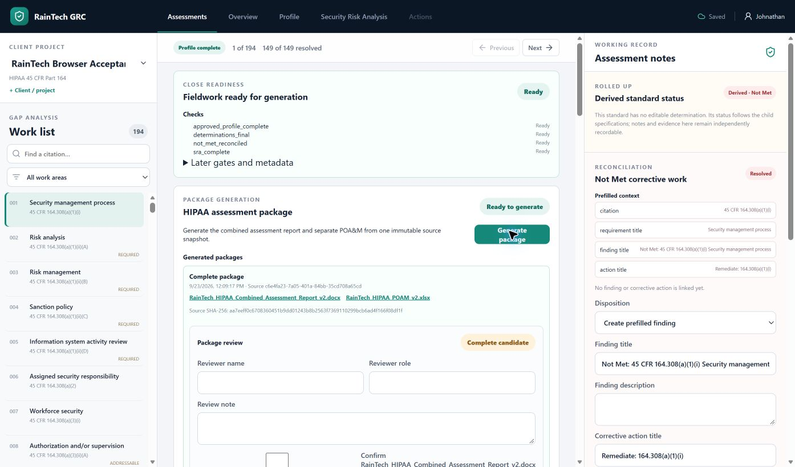
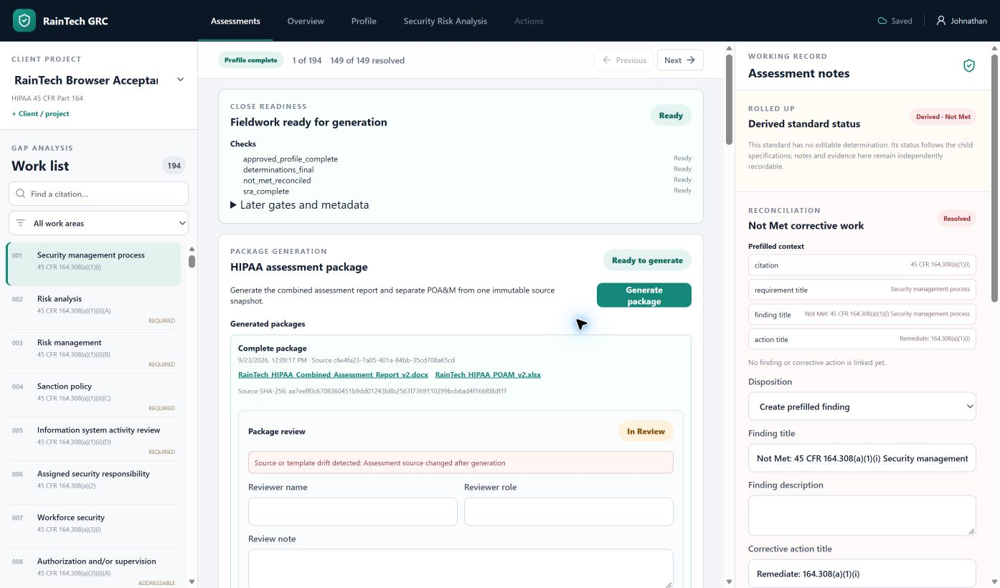
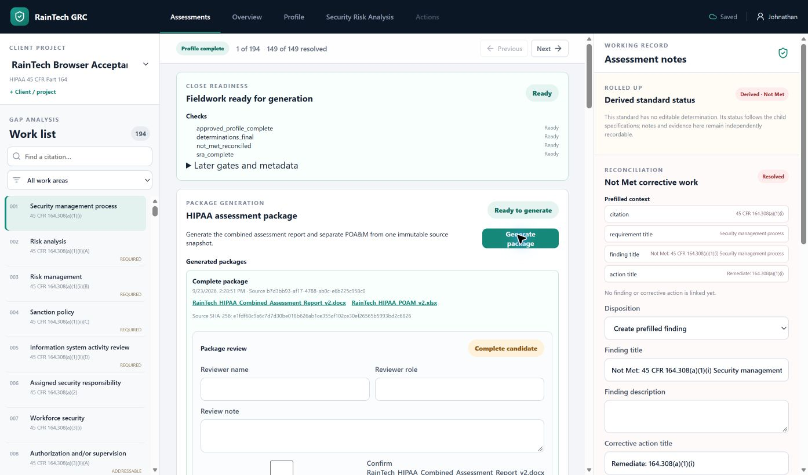
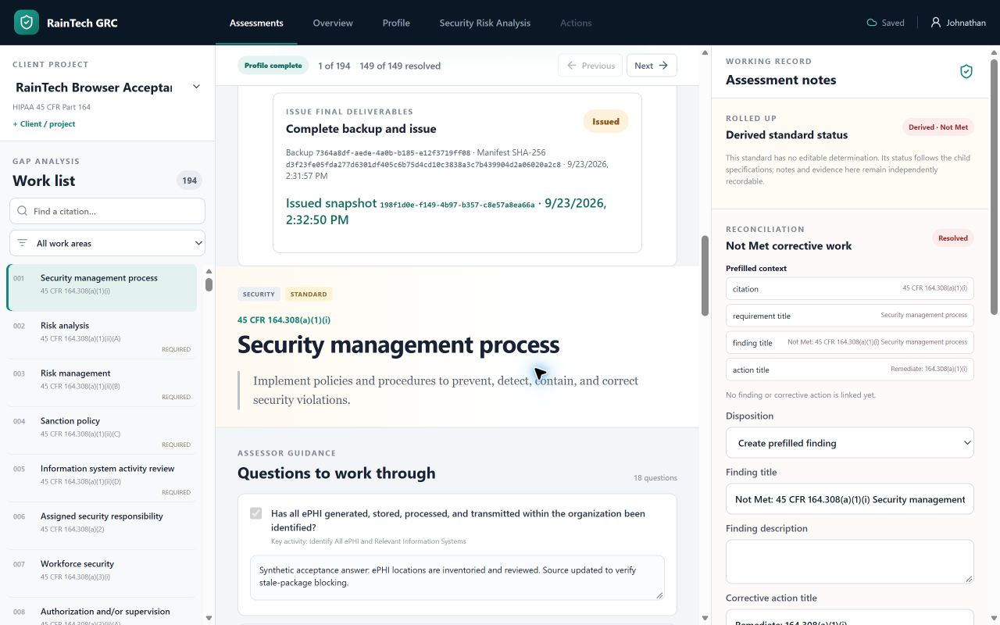

# Packaged Edge browser verification

- Date: September 21, 2026
- Branch: `feature/32-windows-acceptance`
- Host: Windows 11 Business 10.0.26200, ARM64
- Browser: Microsoft Edge through the installed browser-control extension

## Result

The rebuilt native ARM64 package was launched directly with an isolated data
root at `C:\Users\johnathan\RainTechAcceptance\edge-20260921`. The visible Edge
workflow passed these checks using synthetic data only:

- opened the compiled application at its loopback URL;
- created a client and HIPAA project;
- enforced the operating-boundary acknowledgement and reviewer-evidence gates;
- moved intake through `Intake complete` and `Profile complete`;
- started the pinned `hipaa-45cfr164-2026-07-01` assessment;
- displayed the complete 194-record HIPAA work list;
- saved a question-level answer and retained it after a full page reload;
- derived the question completion indicator from the persisted answer; and
- reported no browser console warnings or errors.

The first pass exposed a misleading uncontrolled question checkbox that reset
after reload even though its answer persisted. The checkbox is now a disabled,
derived completion indicator: non-empty saved answers display checked and blank
answers display unchecked. A frontend regression test covers the answered
state, and the rebuilt package was rechecked in Edge.

## Packaging workflow check

Sequential ARM64 and x64 builds now retain both ZIPs and checksum files even
though the frontend build recreates `dist`. Both retained packages passed the
isolated verifier after the fix.

## September 22-23 continuation

The same isolated synthetic project reached fieldwork-close readiness in the
packaged ARM64 application. Profile version 2 was approved with synthetic
environment, inventory, business process, location, and external-service data.
Four SRA scope targets were reviewed, one synthetic risk was recorded, and all
149 determination-bearing records in the 194-record framework were finalized.
One Not Met record was linked to a synthetic finding and open corrective action.
The fieldwork-close API and visible Edge panel both reported **Ready** with no
blockers. The earlier saved question answer remained present after reload.
`prepare_synthetic_fieldwork.py` records the reproducible, project-pinned setup
through production HTTP endpoints; it does not write SQLite or prompt answers.

The first visible Generate package action failed with the exact message
`Snapshot is not renderable: records[42] has non-final determination`, although
fieldwork close was Ready. The snapshot builder had overwritten a Not Met
determination with the linked action's Open status. Generation and rendering now
keep the determination and action status separate. A regression test exercises
generation with a reconciled, open Not Met action. The backend suite passes
145 tests. The suite also exposed a Windows path-length failure in isolated
recovery with a deeply nested generated component; recovery now writes such
files using the extended Windows path form, and the focused recovery tests pass.

Both corrected ZIPs were rebuilt and passed isolated launch, restart,
persistence, and loopback-only verification. This is a new package build; the
September 21 package hashes above remain historical evidence.

| Build | Size | SHA-256 | Verification host |
| --- | ---: | --- | --- |
| ARM64 | 29.2 MiB | `BE34C11F7283844E7F08BAFD972AA41DAD78162CEE0906050977B56E02F2B3B6` | Native ARM64 |
| x64 | 28.9 MiB | `055F4D869D57C06A19C49FF79A7AE22612BF1F59B1EF455BACFCE0FC7612FF68` | ARM64 emulation |

The ARM64 package was extracted at
`C:\Users\johnathan\RainTechAcceptance\package-arm64-generation-fix` for the
next browser pass.

## Generated candidate inspection and corrected render build

The visible Edge flow generated package
`72a30390-a9b1-48cc-8896-6ae144d11a70` from synthetic source snapshot
`c6e4fa23-7a05-401a-84bb-35cd708a65cd`. Both component links returned
hash-matching, parseable ZIP files. Content inspection found that the POA&M
renderer replaced the 29-column header instead of populating data row 4, and
the report omitted project and client names. The candidate was moved only to
`In Review`; it was not marked Reviewed, signed, backed up, or issued.

The source snapshot now includes project/client names and the linked finding
and corrective-action text. The renderer preserves the POA&M header and writes
the reconciled Not Met item to the correct 29-column data row. A frontend
validation error that displayed `[object Object]` now names the invalid fields.
The backend suite passed 145 tests after updating the row-placement contract;
52 frontend tests, typecheck, lint, and production build passed. The corrected
packages passed isolated launch, restart, persistence, and loopback-only checks:

| Build | Size | SHA-256 | Verification host |
| --- | ---: | --- | --- |
| ARM64 | 29.2 MiB | `7FBEE0978DF48D1125CE80A1EB5FD794E8A6D1D327BFE27906D518DD6233A949` | Native ARM64 |
| x64 | 29.0 MiB | `96EF987CBF78938507793385A72F40555E8BB8D418015ABDE7236D82A5321D10` | ARM64 emulation |

The corrected ARM64 build is extracted at
`C:\Users\johnathan\RainTechAcceptance\package-arm64-renderer-fix` for the
final visible browser pass described below.

## September 23 signed issuance and retrieval

The corrected package relaunched against the same synthetic data root. The
older, unsigned candidate displayed **Assessment source changed after
generation** and its backup/issue gate was blocked. This is the visible
stale-source check; the old candidate was never signed or issued.

Edge generated a new candidate, package
`04129ae8-784f-461f-af72-fab394823eed`, from source snapshot
`b7d3bb93-af17-4788-ab0c-e6b225c958c0` (SHA-256
`e1fdf68c9a6c7d7d30be018b626ab1ce355af102ce30ef26565b5993bd2c6826`).
The DOCX link returned 66,565 bytes with SHA-256
`f962858e5e3225b7b0edea1b1197ae7c32c65af0330db22f6d2ed3465f2fec07`;
it includes the synthetic client/project names, Not Met determination, and
finding title. The XLSX link returned 54,378 bytes with SHA-256
`63d8ca69aaa486ba5359a70f882f92a0969cd42191bb47310bec9cbc24558e76`;
the Open POA&M sheet has all 29 named headers at row 3 and its open synthetic
finding in the 29-cell row 4. Both files passed ZIP integrity checks.

The visible reviewer recorded their name, role, and exact-package note,
confirmed both component hashes and the source/template, marked the candidate
Reviewed, then explicitly signed it **Ready to issue**. This pass exposed a
frontend refresh gap: the backup panel required a page reload to read the new
signed state. The panel now refreshes on sign-off, and a focused regression
test confirms the backup button enables without a reload. Edge then created
and validated complete
backup `7364a8df-aede-4a0b-b185-e12f3719ff08`, manifest SHA-256
`d3f23fe05fda277d6301df405c6b75d4cd10c3838a3c7b439904d2a06020a2c8`.
The backup ZIP SHA-256 is
`62d8c740ff52f8f295c866381dac49e37ded8102ea8450a0bc27287bb4557bbf`.
The packaged standalone recovery executable restored this exact ZIP into the
separate `RainTechAcceptance\issue32-backup-7364-validation` directory; it
contains `workspace.db`, managed files, recovery metadata, and templates.

Edge atomically issued snapshot `198f1d0e-f149-4b97-b357-c8e57a8ea66a`,
bound to the signed package, source snapshot, and backup. After packaged-app
shutdown and restart, Edge still displayed the same issued and backup IDs.
Both visible component download URLs returned the original SHA-256 hashes
after restart. The issued package stayed **Issued** after an independent
failed-backup exercise on the older stale candidate: its backup POST returned
HTTP 409, and readiness retained attributed attempt
`7cade97e-5b64-4247-9516-d006c915b3d2` at `preconditions` with the
stale-source/sign-off reasons.

At an explicit 1280 x 800 Edge viewport, `innerWidth` and document
`scrollWidth` were both 1280, with no horizontal overflow. The issued panel,
assessment, and saved question answer remained visible and usable. The Edge
console reported no warnings or errors during this late-stage pass.

The signed-state refresh fix was then packaged in final ZIPs. All 52 frontend
tests, ESLint, typecheck, and production build passed. Both
final ZIPs again passed isolated launch, restart, persistence, and
loopback-only verification. The final ARM64 build was launched against the
issued synthetic data root, and Edge again showed the same issued snapshot
without console warnings or errors. Both component URLs again returned their
recorded hashes.

| Final build | Size | SHA-256 | Verification host |
| --- | ---: | --- | --- |
| ARM64 | 29.2 MiB | `0A0030640906E3683D29642B7761310509FCABC4FEADBC92F9430CF9D69C8913` | Native ARM64 |
| x64 | 29.0 MiB | `48F82492C4642AE2BCB11B34D94D8449DC0A2F0FA85D0B3AC8EAD2FF4444EDC0` | ARM64 emulation |

The final ARM64 extraction is
`C:\Users\johnathan\RainTechAcceptance\package-arm64-final-issue32`.

## Remaining physical acceptance

- Repeat the package run with the host network adapter disabled. This is not
  safe to perform in the active remote development session.
- Observe downloaded-file SmartScreen behavior from the intended distribution
  channel. Local build execution does not create downloaded-file reputation.
- Run the x64 package on native x64 Windows hardware; the current x64 result is
  under Windows-on-ARM emulation.
