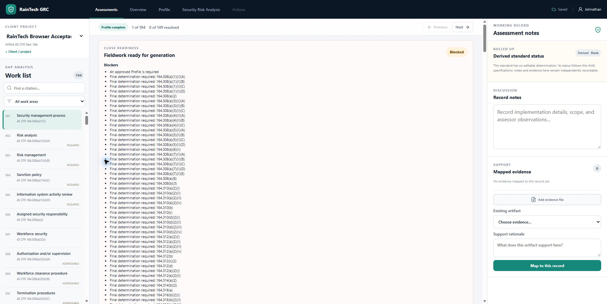
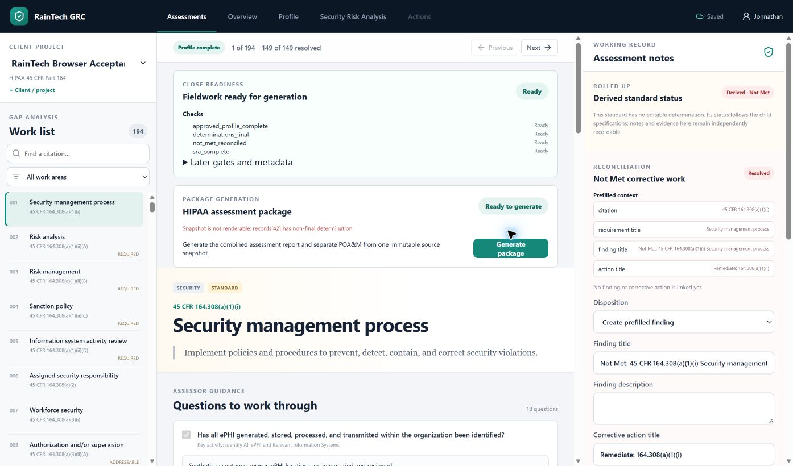

# Packaged Edge browser verification

- Date: September 21, 2026
- Branch: `feature/32-windows-acceptance`
- Host: Windows 11 Business 10.0.26200, ARM64
- Browser: Microsoft Edge through the installed browser-control extension

## Result

The rebuilt native ARM64 package was launched directly with an isolated data
root at `C:\Users\johnathan\RainTechAcceptance\edge-20260921`. The visible Edge
workflow passed these checks using synthetic data only:

- opened the compiled application at its loopback URL;
- created a client and HIPAA project;
- enforced the operating-boundary acknowledgement and reviewer-evidence gates;
- moved intake through `Intake complete` and `Profile complete`;
- started the pinned `hipaa-45cfr164-2026-07-01` assessment;
- displayed the complete 194-record HIPAA work list;
- saved a question-level answer and retained it after a full page reload;
- derived the question completion indicator from the persisted answer; and
- reported no browser console warnings or errors.

The first pass exposed a misleading uncontrolled question checkbox that reset
after reload even though its answer persisted. The checkbox is now a disabled,
derived completion indicator: non-empty saved answers display checked and blank
answers display unchecked. A frontend regression test covers the answered
state, and the rebuilt package was rechecked in Edge.

## Packaging workflow check

Sequential ARM64 and x64 builds now retain both ZIPs and checksum files even
though the frontend build recreates `dist`. Both retained packages passed the
isolated verifier after the fix.

## September 22-23 continuation

The same isolated synthetic project reached fieldwork-close readiness in the
packaged ARM64 application. Profile version 2 was approved with synthetic
environment, inventory, business process, location, and external-service data.
Four SRA scope targets were reviewed, one synthetic risk was recorded, and all
149 determination-bearing records in the 194-record framework were finalized.
One Not Met record was linked to a synthetic finding and open corrective action.
The fieldwork-close API and visible Edge panel both reported **Ready** with no
blockers. The earlier saved question answer remained present after reload.
`prepare_synthetic_fieldwork.py` records the reproducible, project-pinned setup
through production HTTP endpoints; it does not write SQLite or prompt answers.

The first visible Generate package action failed with the exact message
`Snapshot is not renderable: records[42] has non-final determination`, although
fieldwork close was Ready. The snapshot builder had overwritten a Not Met
determination with the linked action's Open status. Generation and rendering now
keep the determination and action status separate. A regression test exercises
generation with a reconciled, open Not Met action. The backend suite passes
145 tests. The suite also exposed a Windows path-length failure in isolated
recovery with a deeply nested generated component; recovery now writes such
files using the extended Windows path form, and the focused recovery tests pass.

Both corrected ZIPs were rebuilt and passed isolated launch, restart,
persistence, and loopback-only verification. This is a new package build; the
September 21 package hashes above remain historical evidence.

| Build | Size | SHA-256 | Verification host |
| --- | ---: | --- | --- |
| ARM64 | 29.2 MiB | `BE34C11F7283844E7F08BAFD972AA41DAD78162CEE0906050977B56E02F2B3B6` | Native ARM64 |
| x64 | 28.9 MiB | `055F4D869D57C06A19C49FF79A7AE22612BF1F59B1EF455BACFCE0FC7612FF68` | ARM64 emulation |

The corrected ARM64 package is extracted at
`C:\Users\johnathan\RainTechAcceptance\package-arm64-generation-fix` and awaits
relaunch against the same synthetic data root. Package generation, exact review
and sign-off, complete backup, issuance, restart, and immutable retrieval still
require the corrected visible Edge pass.

## Remaining physical acceptance

- Repeat the package run with the host network adapter disabled. This is not
  safe to perform in the active remote development session.
- Observe downloaded-file SmartScreen behavior from the intended distribution
  channel. Local build execution does not create downloaded-file reputation.
- Run the x64 package on native x64 Windows hardware; the current x64 result is
  under Windows-on-ARM emulation.
