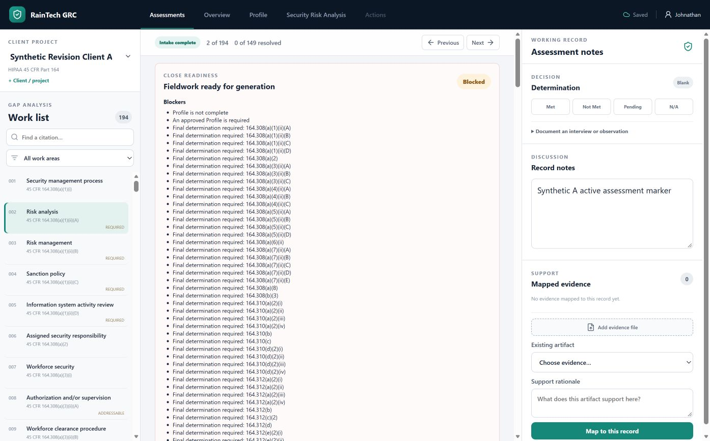

# Issue #75 active assessment browser and API verification

Date: September 24, 2026. Branch: `feature/75-active-assessment-backend`.
Host: Microsoft Surface Pro 11, Windows 11 Business 10.0.26200, ARM64.

The current source branch and compiled UI ran from `api.windows_launcher` on
`127.0.0.1:18575` with a separate synthetic data root at
`C:\Users\johnathan\RainTechAcceptance\issue75-browser`. The live Surface
pilot on port `18433` was not changed.

Edge opened three synthetic HIPAA assessments: two projects under Synthetic
Revision Client A, and a third project under Synthetic Revision Client C.
In Project A, record `164.308(a)(1)(ii)(A)` saved the note
`Synthetic A active assessment marker`. Switching to Project B under the same
client and then Project C under a different client showed the corresponding
active assessment with a blank note for that record. Switching back to Project
A restored the saved note. The Edge console had no warnings or errors.

The focused API/compatibility tests passed 23 cases, including guessed ID
rejection and direct-SQL active-pointer ownership. The complete API suite
passed 151 tests. The existing one-assessment-per-project constraint means an
inactive but otherwise valid successor assessment cannot yet be produced
through the application; successor creation is explicitly deferred to #79.

The isolated service shut down and released port `18575`. The packaged Surface
pilot on port `18433` still returned `status: ok` from `/api/health`.
